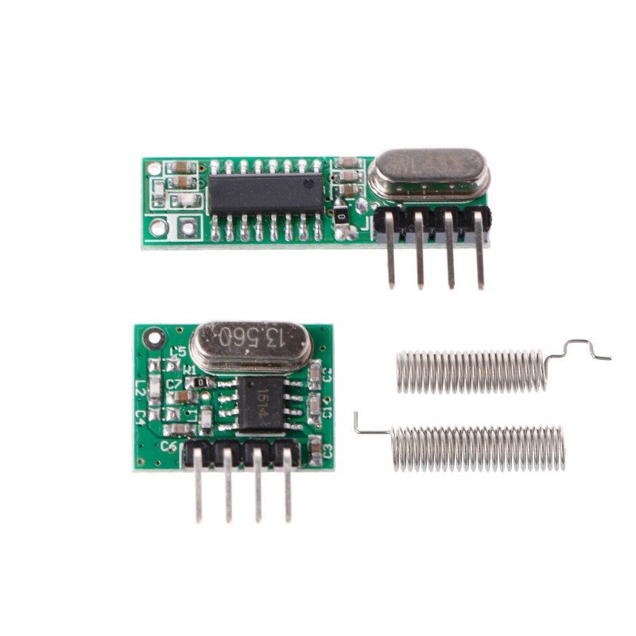

# ESP8266 RF 433MHz

Sample of radio frequency module integration with Arduino/ESP8266.

I'm using super heterodine modules in my tests (not concluded yet).

## Subfolders

- **esp8266-rf-433mhz-rcswitch/** example using RCSwitch library
- **esp8266-rf-433mhz-rhask/** example using RadioHead library
- **esp8266-rf-433mhz-receiver/** receiver example
- **esp8266-rf-433mhz-transmitter/** transmitter example
